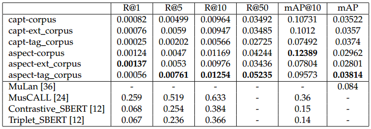

# Busqueda-semantica-en-audios.-Tesis

The current state of the tesis can be found [here](https://github.com/NileyGF/Busqueda-semantica-en-audios.-Tesis/blob/main/docs/Recuperaci%C3%B3n_sem%C3%A1ntica_de_m%C3%BAsica_utilizando_embeddings_y_modelos_de_clasificaci%C3%B3n.pdf).

Besides de documents on the repository, the analysis of the state of the art on Music Information Retrieval(MIR), is on the google sheet [here](https://docs.google.com/spreadsheets/d/1_MJO6jbfSJLG0gLDlu911yQ0zc3quQeut_394DEvVk4/edit?usp=sharing).

Machine learning, Information Retrieval Systems, Music Information Retrieval, BERT, essentia, Music Classification, NLP

### Requirements: Linux or MacOS, python 3.10

1. install miniconda following the instruction at : https://docs.conda.io/projects/miniconda/en/latest/ 
2. clone the repository 
3. python310 -m venv env
4. source env/bin/activate
5. conda create -n ess python=3.10
6. conda activate ess
7. conda install -c conda-forge -y cudatoolkit=11.2 cudnn=8.1
8. pip install essentia-tensorflow

To replicate the preprocessing:

    python3 -m src.__main__

To test in django-app:

    cd django-app

    python3 manage.py runserver

## The current results are:

